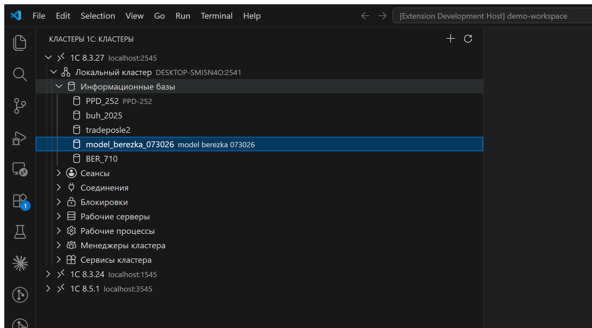

# 1C Cluster Manager for VS Code

> 🚧 **Проект находится в активной разработке.** API, настройки и состав функций могут изменяться; перед административными операциями используйте тестовый контур.

Самостоятельное решение для администрирования кластеров 1С:Предприятия из VS Code через штатные `RAS` и `rac`.

## Интерфейс



На снимке показаны реальные локальные подключения к платформам 1С 8.3.27, 8.3.24 и 8.5.1; для кластера 8.3.27 раскрыт список информационных баз.

Проект состоит из двух частей:

- [`backend`](backend) — локальный REST API, который безопасно запускает `rac` и преобразует его вывод в JSON;
- [`extension`](extension) — нативное расширение VS Code с деревом кластеров и командами управления.

## Возможности

- несколько подключений к RAS и отдельный `rac` для каждого подключения;
- автоматический поиск наиболее новой установленной версии `rac.exe`;
- просмотр кластеров, информационных баз, сеансов, соединений, блокировок, рабочих серверов, процессов, менеджеров и сервисов;
- завершение сеанса и прерывание текущего серверного вызова;
- разрыв соединения и выключение рабочего процесса;
- блокировка начала сеансов и регламентных заданий информационной базы;
- хранение паролей администраторов в VS Code `SecretStorage`;
- опциональная bearer-аутентификация backend;
- автоматический запуск встроенного backend при открытии панели расширения.

## Быстрый старт

Требуются Node.js 20+, VS Code 1.96+, запущенный RAS и установленная утилита `rac`.

```powershell
npm install
npm run check
npm run package --workspace onec-cluster-manager
```

Установите созданный файл `extension/onec-cluster-manager-0.1.0.vsix` командой **Extensions: Install from VSIX...**. Затем откройте раздел «Кластеры 1С» на панели активности и нажмите «Добавить подключение».

Для локальных установок расширение само запускает упакованный backend на `127.0.0.1:32145`. Адрес и автозапуск настраиваются параметрами `onecClusterManager.backend.url` и `onecClusterManager.backend.autoStart`.

## Самостоятельный запуск backend

```powershell
$env:ONEC_CLUSTER_MANAGER_HOST = "127.0.0.1"
$env:ONEC_CLUSTER_MANAGER_PORT = "32145"
$env:ONEC_CLUSTER_MANAGER_CONFIG_FILE = "C:\ProgramData\onec-cluster-manager-vscode\connections.json"
$env:ONEC_CLUSTER_MANAGER_API_TOKEN = "replace-with-a-long-random-value" # необязательно для loopback
npm run build --workspace @onec-cluster-manager/backend
npm start --workspace @onec-cluster-manager/backend
```

Если задан `ONEC_CLUSTER_MANAGER_API_TOKEN`, сохраните то же значение командой **1C: Указать токен backend**.

## API

Основные маршруты:

```text
GET/POST  /api/connections
DELETE    /api/connections/{connectionId}
GET       /api/connections/{connectionId}/clusters
GET       /api/connections/{connectionId}/clusters/{clusterId}/infobases
GET       /api/connections/{connectionId}/clusters/{clusterId}/sessions
GET       /api/connections/{connectionId}/clusters/{clusterId}/connections
GET       /api/connections/{connectionId}/clusters/{clusterId}/locks
GET       /api/connections/{connectionId}/clusters/{clusterId}/servers
GET       /api/connections/{connectionId}/clusters/{clusterId}/processes
GET       /api/connections/{connectionId}/clusters/{clusterId}/managers
GET       /api/connections/{connectionId}/clusters/{clusterId}/services
```

Административные операции выполняются `POST`-маршрутами `terminate`, `interrupt`, `disconnect`, `turn-off` и `settings`. Backend по умолчанию слушает только loopback-интерфейс. Учётные данные кластера и информационной базы не записываются backend на диск.

## Разработка

Откройте корень репозитория в VS Code и запустите конфигурацию **Run 1C Cluster Manager Extension**. Перед запуском задача сборки скомпилирует backend и скопирует его в пакет расширения.
